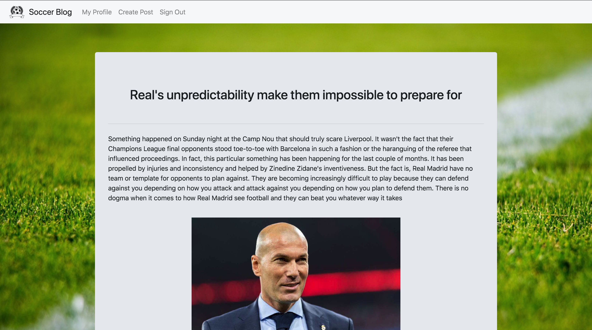

# Soccer Blog Rumblr (Ruby Tumblr) 
## Blog for soccer lovers built with Ruby.

## Tools Used:
* Ruby
* Sinatra
* PostgreSQL
* Bootstrap
* Heroku

## Features:
* Users can sign up for an account
* Users can post blog posts with images
* Users can delete their blog posts
* Users can edit their account information and delete account

## How to Use:
* Heroku link: https://floating-garden-58367.herokuapp.com/
* Username: minhalg
* Password: 12345

## Screenshots:
* Main Page:

* New Post:

